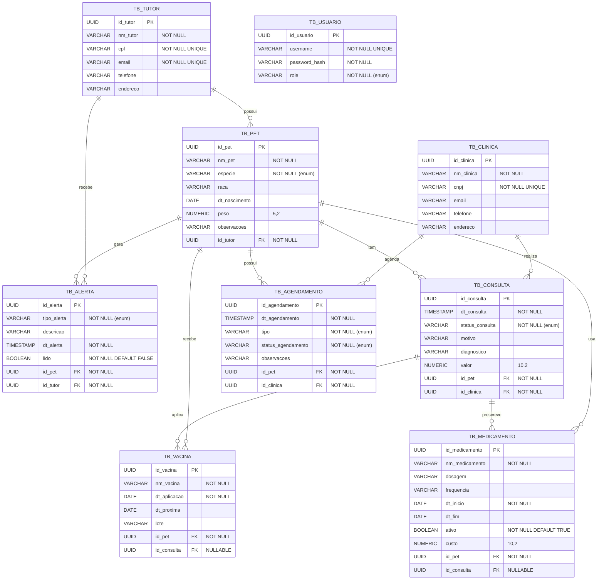

# Diagrama de Entidade-Relacionamento (DER) — Pet360

> Challenge FIAP — Java Advanced 2026 — CLYVO VET / Pet360
> Vale **até 10 pontos** (em conjunto com o diagrama de classes).

Este DER reflete fielmente as 9 tabelas físicas criadas pelo Hibernate a partir das entidades JPA do projeto. Cores de coluna seguem o padrão do DDL Oracle original (`Challenge 1.sql`).

## Diagrama (Mermaid)

## Constraints e regras

### Chaves primárias
Todas as PK são `UUID` geradas pelo banco via `@GeneratedValue(strategy = GenerationType.UUID)`.

### Chaves estrangeiras (cardinalidade)

| Tabela origem | Coluna FK | Tabela destino | Cardinalidade |
|---|---|---|---|
| `TB_PET` | `ID_TUTOR` | `TB_TUTOR` | N:1 (obrigatório) |
| `TB_CONSULTA` | `ID_PET` | `TB_PET` | N:1 (obrigatório) |
| `TB_CONSULTA` | `ID_CLINICA` | `TB_CLINICA` | N:1 (obrigatório) |
| `TB_VACINA` | `ID_PET` | `TB_PET` | N:1 (obrigatório) |
| `TB_VACINA` | `ID_CONSULTA` | `TB_CONSULTA` | N:1 (opcional) |
| `TB_MEDICAMENTO` | `ID_PET` | `TB_PET` | N:1 (obrigatório) |
| `TB_MEDICAMENTO` | `ID_CONSULTA` | `TB_CONSULTA` | N:1 (opcional) |
| `TB_AGENDAMENTO` | `ID_PET` | `TB_PET` | N:1 (obrigatório) |
| `TB_AGENDAMENTO` | `ID_CLINICA` | `TB_CLINICA` | N:1 (obrigatório) |
| `TB_ALERTA` | `ID_PET` | `TB_PET` | N:1 (obrigatório) |
| `TB_ALERTA` | `ID_TUTOR` | `TB_TUTOR` | N:1 (obrigatório) |

### Unique constraints
- `TB_TUTOR.CPF`, `TB_TUTOR.EMAIL`
- `TB_CLINICA.CNPJ`
- `TB_USUARIO.USERNAME`

### Cascade e orphanRemoval
- `Tutor → Pet`: cascade ALL + orphanRemoval (remover tutor remove seus pets)
- `Pet → Vacina/Medicamento/Consulta/Agendamento/Alerta`: cascade ALL + orphanRemoval
- `Consulta → Vacina/Medicamento`: cascade ALL (vínculo opcional, sem orphanRemoval)

## Justificativa do modelo

O modelo separa **Vacina**, **Medicamento**, **Agendamento** e **Alerta** em tabelas próprias (ao invés de consolidar em "EventoSaude") por três motivos:

1. **Riqueza semântica** — cada entidade tem atributos próprios (Vacina tem `dt_proxima`/`lote`; Medicamento tem `dosagem`/`frequencia`/`ativo`/`custo`; Agendamento tem `status` e `tipo` distintos do Alerta).
2. **Consultas otimizadas** — buscar "medicamentos ativos" ou "vacinas vencidas" fica natural sem `WHERE tipo = X`.
3. **Coerência com KPIs da CLYVO VET** — taxa de adesão vacinal e LTV por pet exigem tabelas dedicadas.

`TB_USUARIO` existe apenas para autenticação JWT e não tem relacionamentos com o domínio funcional.
