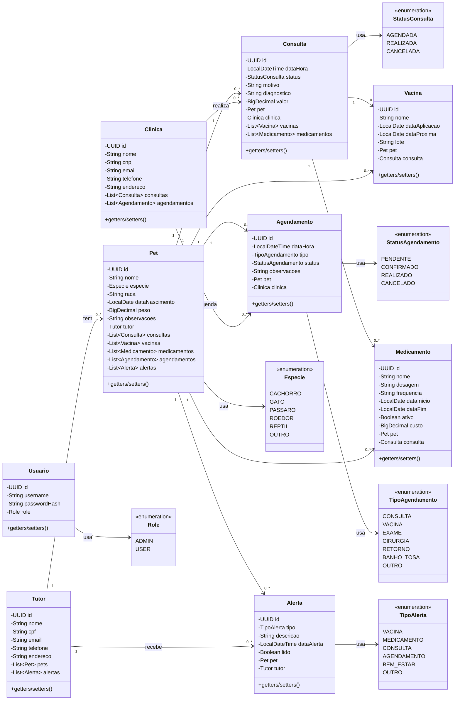

# Diagrama de Classes de Entidade — Pet360

> Challenge FIAP — Java Advanced 2026 — CLYVO VET / Pet360
> Vale **até 10 pontos** (em conjunto com o DER).

Diagrama de classes das entidades JPA. Cardinalidades e tipos seguem fielmente o código em `src/main/java/br/com/fiap/pet360/model/`.

## Diagrama (Mermaid)

## Convenções de implementação

Todas as entidades seguem o estilo do professor Luiz Real (lgsreal) e o material compartilhado em aula:

| Convenção | Detalhe |
|---|---|
| **Sem Lombok** | Getters/setters explícitos. Lombok é problemático com `equals/hashCode` em entidades Hibernate. |
| **UUID como ID** | `@GeneratedValue(strategy = GenerationType.UUID)`. Mais seguro que sequence/identity em sistemas distribuídos. |
| **BigDecimal para dinheiro** | `peso`, `valor`, `custo`. Nunca `double`/`float` (problema do `0.1 + 0.2 = 0.30000000000000004`). |
| **LocalDate / LocalDateTime** | Sem `java.util.Date` legado. |
| **Dois construtores** | Vazio (exigido pelo JPA) + construtor com campos principais. |
| **Equals/HashCode** | Baseados apenas no ID, com guarda para `id != null`. |
| **FK lazy** | `@ManyToOne(fetch = FetchType.LAZY)` para evitar N+1 acidental. |
| **Enums como STRING** | `@Enumerated(EnumType.STRING)` — legível e robusto contra reordenação. |

## Mapeamento Classe ↔ Tabela

| Classe Java | Tabela H2/Oracle |
|---|---|
| `Tutor` | `TB_TUTOR` |
| `Clinica` | `TB_CLINICA` |
| `Pet` | `TB_PET` |
| `Consulta` | `TB_CONSULTA` |
| `Vacina` | `TB_VACINA` |
| `Medicamento` | `TB_MEDICAMENTO` |
| `Agendamento` | `TB_AGENDAMENTO` |
| `Alerta` | `TB_ALERTA` |
| `Usuario` | `TB_USUARIO` |

Coerência com o DER: o nome lógico em camelCase no Java mapeia para o nome físico em SNAKE_CASE com prefixo `TB_` no banco — convenção da FIAP herdada do DDL Oracle original.
